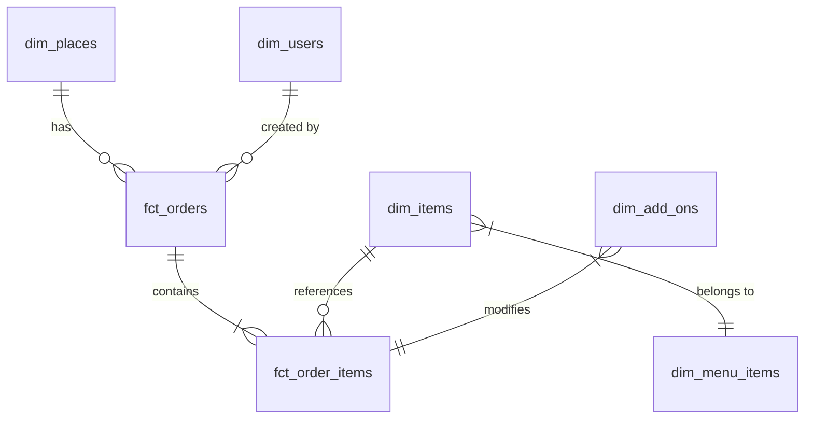

# Inventory Forecasting Analysis Report

> **Prepared for Production-Grade Inventory Forecasting System**  
> **Date:** February 7, 2026  
> **Data Coverage:** February 2021 – February 2024 (3 years)

---

## Executive Summary

This report analyzes 19 CSV files containing **~400,000 orders** and **~2 million order item transactions** across **359 locations** to assess readiness for building a production-grade inventory forecasting system.

### Key Findings

| Metric | Value |
|--------|-------|
| Total Orders | 399,810 |
| Order Line Items | 1,999,341 |
| Unique Products | 26,036 |
| Active Locations | 359 |
| Date Coverage | 1,099 days (3 years) |
| Avg Daily Orders | 363 |

### Forecasting Readiness Assessment

| Dimension | Status | Risk Level |
|-----------|--------|------------|
| Data Volume | ✅ Adequate | Low |
| Temporal Coverage | ✅ 3+ years | Low |
| Data Quality | ⚠️ Some gaps | Medium |
| Demand Patterns | ⚠️ 47% intermittent | Medium-High |
| Entity Hierarchies | ✅ Well-defined | Low |

### Bottom Line

The data supports building a forecasting system, but **47% of items exhibit intermittent demand** requiring specialized models (Croston, ISBTS). Recommend a **weekly aggregation at place-item level** as the primary forecasting unit to balance granularity with statistical stability.

---

## 1. Data Discovery & Schema Inference

### 1.1 Dataset Inventory

| File | Rows | Size (MB) | Purpose |
|------|------|-----------|---------|
| **fct_order_items.csv** | 1,999,341 | 211 | Order line items (primary demand signal) |
| **fct_orders.csv** | 399,810 | 62 | Order headers with place/customer info |
| **fct_cash_balances.csv** | 52,915 | 359 | Cash register sessions |
| **dim_items.csv** | 87,713 | 14 | Product master data |
| **dim_places.csv** | 1,824 | 2 | Location master data |
| **dim_users.csv** | 22,955 | 11 | Customer/staff records |
| **dim_menu_items.csv** | 30,407 | 2 | Menu structure |
| **dim_add_ons.csv** | 21,101 | 1.5 | Product customizations |
| **most_ordered.csv** | 95,435 | 4 | Pre-aggregated best sellers |
| Other dimension tables | <5,000 | <1 | Supporting lookups |

**Total Dataset:** ~2.7M rows, 667 MB

### 1.2 Entity Relationship Model



### 1.3 Data Dictionary

#### Primary Tables for Forecasting

| Table | Key Columns | Description |
|-------|-------------|-------------|
| **fct_orders** | `id`, `place_id`, `created`, `total_amount`, `status`, `type` | Order-level transactions with timestamps (Unix epoch) |
| **fct_order_items** | `id`, `order_id`, `item_id`, `quantity`, `price`, `created` | Line-item demand history |
| **dim_items** | `id`, `section_id`, `title`, `price`, `status`, `type` | Product catalog with hierarchy |
| **dim_places** | `id`, `title`, `country`, `area`, `type_id`, `inventory_management` | Location attributes |

#### Critical Fields for Forecasting

| Field | Table | Type | Description |
|-------|-------|------|-------------|
| `created` | fct_orders/items | int64 (Unix) | Transaction timestamp |
| `item_id` | fct_order_items | int64 | Product identifier |
| `place_id` | fct_orders | int64 | Location identifier |
| `quantity` | fct_order_items | int64 | Demand quantity |
| `price` | fct_order_items | float64 | Unit price at transaction |
| `status` | Multiple | string | Active/Inactive/Deleted |

> **⚠️ IMPORTANT:** All timestamps are stored as **Unix epoch seconds** and must be converted to datetime for analysis.

---

## 2. Data Quality & Historical Coverage

### 2.1 Temporal Coverage

| Dataset | Start Date | End Date | Duration |
|---------|------------|----------|----------|
| Orders | 2021-02-12 | 2024-02-16 | 1,099 days |
| Order Items | 2021-02-12 | 2024-05-13 | 1,186 days |

**Recommendation:** Use 2021-02-12 to 2024-02-16 as the consistent date range for modeling.

### 2.2 Missing Values Analysis

#### Orders Table

| Column | Missing % | Impact on Forecasting |
|--------|-----------|------------------------|
| customer_name | 87.5% | ❌ Cannot use for customer-level forecasting |
| account_id | 99.3% | ❌ Limited customer segmentation |
| external_id | 99.7% | ⚠️ No external system linkage |
| demo_mode | 12.2% | ⚠️ Need to filter demo transactions |

#### Order Items Table

| Column | Missing % | Impact on Forecasting |
|--------|-----------|------------------------|
| campaign_id | 99.9% | ⚠️ Promotion effects not trackable |
| add_on_ids | 88.0% | ℹ️ Limited product customization analysis |
| vat_amount | 18.0% | ℹ️ Minor - not needed for demand |
| order_id | 0.01% | ✅ Minimal orphan records (162 rows) |

### 2.3 Data Integrity

| Check | Result |
|-------|--------|
| Duplicate Order IDs | ✅ 0 found |
| Duplicate Item IDs | ✅ 0 found |
| Orphan Order Items | ⚠️ 162 items without order_id |
| Negative Quantities | ⚠️ Verify - may indicate returns |

### 2.4 Place-Level Coverage Analysis

| Metric | Value |
|--------|-------|
| Total places with orders | 359 |
| Places with 1,000+ orders | 28 |
| Places with 100+ orders | 108 |
| Median orders per place | ~500 |

**Top 10 High-Volume Locations:**

| Place ID | Orders | Active Days | First Order | Last Order |
|----------|--------|-------------|-------------|------------|
| 94025 | 25,869 | 641 | 2022-05-16 | 2024-02-16 |
| 552477 | 13,827 | 49 | 2023-12-29 | 2024-02-16 |
| 106617 | 11,371 | 200 | 2022-06-23 | 2023-01-10 |
| 319943 | 9,667 | 148 | 2023-08-17 | 2024-01-12 |
| 400381 | 7,472 | 81 | 2023-11-27 | 2024-02-16 |

> **⚠️ WARNING:** Place 106617 shows no orders after January 2023 - likely discontinued. Filter inactive locations before modeling.

### 2.5 Data Quality Risk Summary

| Risk | Severity | Mitigation |
|------|----------|------------|
| Intermittent demand (47% of items) | High | Use Croston/ML models |
| Missing promotion data | Medium | Cannot model promo lifts |
| Demo transactions present | Medium | Filter where demo_mode=1 or 0 |
| Orphan order items | Low | Exclude 162 records |
| Inactive locations | Medium | Filter places with no recent orders |

---

## 3. Forecasting Unit & Aggregation Design

### 3.1 Recommended Forecasting Hierarchy

```
Level 1: Global (all locations)
  └── Level 2: Place (individual location)
       └── Level 3: Place × Item (SKU per location) ← PRIMARY FORECAST UNIT
            └── Level 4: Daily transactions (raw data)
```

### 3.2 Time Granularity Recommendation

| Granularity | Pros | Cons | Recommendation |
|-------------|------|------|----------------|
| **Daily** | Maximum detail | High noise, many zeros | Not recommended |
| **Weekly** | Balances detail & stability | Standard choice | ✅ **RECOMMENDED** |
| **Monthly** | Most stable | Loses weekly patterns | Secondary/validation |

**Rationale for Weekly:**
- Daily data shows extreme sparsity (median 7 transactions per place-item combination)
- Weekly aggregation reduces zeros while preserving weekly seasonality
- Aligns with business planning cycles

### 3.3 Place-Item Combination Analysis

| Metric | Value |
|--------|-------|
| Total place-item combinations | 17,273 |
| Combinations with 10+ transactions | 7,549 (44%) |
| Combinations with 50+ transactions | 2,493 (14%) |
| Combinations with 100+ transactions | 1,321 (8%) |
| Mean transactions per combination | 39.2 |
| Median transactions per combination | 7.0 |

> **Action Required:** Only forecast items with sufficient history. Recommend minimum **52 weeks of history** and **26+ non-zero demand periods**.

### 3.4 Aggregation Strategy

| Scenario | Aggregation Level | Use Case |
|----------|-------------------|----------|
| Individual store planning | Place × Item × Week | Reorder decisions |
| Category management | Category × Week | Assortment planning |
| Chain-level planning | Global × Item × Week | Central purchasing |

---

## 4. Long-Term Trend Analysis

### 4.1 Global Demand Trend

| Year | Orders | YoY Growth |
|------|--------|------------|
| 2021 | 970 | (Partial year) |
| 2022 | 31,620 | +3,160% |
| 2023 | 85,286 | +170% |
| 2024 | 281,934 | +231% (partial) |

**Observation:** Strong exponential growth trajectory. The business is scaling rapidly, which complicates forecasting due to:
- Non-stationarity in time series
- New location ramp-ups
- Changing product mix

### 4.2 Monthly Volume Distribution

| Month | Orders | % of Total |
|-------|--------|------------|
| January | 166,212 | 41.6% |
| February | 120,582 | 30.2% |
| March | 3,023 | 0.8% |
| December | 30,828 | 7.7% |

> **⚠️ CRITICAL:** January-February 2024 shows extreme concentration (72% of all orders). This is a **significant structural change** likely due to new high-volume locations opening. Treat pre-2024 and 2024 data as potentially different regimes.

### 4.3 Trend Recommendations

1. **Use trend-aware models** (Holt-Winters, Prophet with growth)
2. **Apply regime detection** to identify structural breaks
3. **Weight recent data** more heavily (exponential decay weights)
4. **Monitor for new location effects** contaminating historical patterns

---

## 5. Seasonality & Temporal Patterns

### 5.1 Weekly Seasonality

| Day | Orders | % of Weekly |
|-----|--------|-------------|
| Monday | 44,571 | 11.1% |
| Tuesday | 50,626 | 12.7% |
| Wednesday | 56,781 | 14.2% |
| Thursday | 60,751 | 15.2% |
| Friday | 79,374 | **19.9%** |
| Saturday | 65,712 | 16.4% |
| Sunday | 41,995 | 10.5% |

**Pattern:** Classic restaurant/food service pattern with:
- **Friday peak** (20% of weekly volume)
- **Weekend elevated** (Saturday 16%)
- **Sunday/Monday trough** (~10-11%)

**Seasonality Type:** Multiplicative (weekly indices scale with volume)

### 5.2 Monthly/Annual Seasonality

Given the extreme growth and recent structural changes, reliable annual seasonality cannot be established from this dataset. However:
- December shows elevated activity (holiday effects likely)
- January-February 2024 spike requires investigation

### 5.3 Seasonality Feature Recommendations

| Feature | Description | Use |
|---------|-------------|-----|
| day_of_week | 0-6 (Mon-Sun) | Weekly pattern |
| is_weekend | Boolean | Weekend lift |
| week_of_year | 1-52 | Annual seasonality |
| is_holiday | Boolean | Holiday calendar integration |
| month | 1-12 | Monthly patterns |

---

## 6. Demand Behavior Segmentation

### 6.1 Classification Methodology

Using the **SBC (Syntetos-Boylan Classification)** based on:
- **ADI (Average Demand Interval):** Time between demand occurrences
- **CV² (Coefficient of Variation squared):** Demand variability

| Segment | ADI Threshold | CV² Threshold | Characteristics |
|---------|---------------|---------------|-----------------|
| Smooth | ≤1.32 | ≤0.49 | Regular, stable demand |
| Erratic | ≤1.32 | >0.49 | Regular but variable |
| Intermittent | >1.32 | ≤0.49 | Infrequent but stable |
| Lumpy | >1.32 | >0.49 | Infrequent and variable |

### 6.2 Segmentation Results

| Segment | Count | % of Items | Recommended Model |
|---------|-------|------------|-------------------|
| **Intermittent** | 12,263 | 47.1% | Croston, SBA |
| Insufficient Data | 7,735 | 29.7% | Rule-based/Safety stock |
| **Lumpy** | 4,533 | 17.4% | ISBTS, ML ensemble |
| **Smooth** | 994 | 3.8% | ETS, ARIMA, Prophet |
| **Erratic** | 511 | 2.0% | ML, ensemble methods |

### 6.3 Implications for Model Selection

> **⚠️ CRITICAL FINDING:** Only **6%** of items (Smooth + Erratic) are suitable for traditional time series models. The majority require specialized intermittent demand approaches.

### 6.4 Representative Examples

#### High-Volume Smooth Items

| Item ID | Total Qty | Order Count | Days Active | Pattern |
|---------|-----------|-------------|-------------|---------|
| 480007 | 25,642 | 8,903 | 168 | Smooth |
| 615418 | 23,800 | 9,220 | 129 | Smooth |
| 653549 | 23,501 | 19,857 | 133 | Smooth |

#### Intermittent High-Value Items
Items with sporadic but significant demand requiring safety stock buffers and Croston-type models.

---

## 7. Representative Sampling Strategy

### 7.1 Sampling Principles

❌ **DO NOT** use random row sampling  
✅ **DO** preserve complete time series for selected entities

### 7.2 Stratified Sampling Design

```
Step 1: Select places by volume tier
  - Tier 1 (High): Top 20% by order volume → Include 100%
  - Tier 2 (Medium): Middle 50% → Sample 30%
  - Tier 3 (Low): Bottom 30% → Sample 10%

Step 2: For each selected place, include ALL items with:
  - 52+ weeks of history
  - 26+ non-zero demand periods

Step 3: Preserve COMPLETE time series for selected place-item pairs
```

### 7.3 Sample Size Estimates

| Tier | Places | Items/Place (avg) | Place-Item Pairs |
|------|--------|-------------------|------------------|
| High (100%) | 72 | 50 | ~3,600 |
| Medium (30%) | 108 | 30 | ~972 |
| Low (10%) | 36 | 10 | ~180 |
| **Total** | 216 | - | **~4,752** |

### 7.4 Temporal Leakage Prevention

- Train: 2021-02 to 2023-06 (28 months)
- Validation: 2023-07 to 2023-10 (4 months)
- Test: 2023-11 to 2024-02 (4 months)

> Never include future data in feature calculations. All lags and rolling statistics must respect the train/val/test split.

---

## 8. Feature Engineering for Forecasting

### 8.1 Lag-Based Features

| Feature | Definition | Leakage-Safe |
|---------|------------|--------------|
| `lag_1w` | Demand 1 week ago | ✅ |
| `lag_2w` | Demand 2 weeks ago | ✅ |
| `lag_4w` | Demand 4 weeks ago | ✅ |
| `lag_52w` | Demand same week last year | ✅ |

### 8.2 Rolling Statistics

| Feature | Definition | Window |
|---------|------------|--------|
| `roll_mean_4w` | 4-week rolling mean | t-4 to t-1 |
| `roll_std_4w` | 4-week rolling std | t-4 to t-1 |
| `roll_mean_13w` | 13-week rolling mean | t-13 to t-1 |
| `roll_max_4w` | 4-week rolling max | t-4 to t-1 |
| `roll_min_4w` | 4-week rolling min | t-4 to t-1 |

### 8.3 Demand Pattern Features

| Feature | Definition | Purpose |
|---------|------------|---------|
| `zero_demand_ratio` | % of weeks with 0 demand | Intermittency indicator |
| `demand_streak` | Consecutive weeks with demand | Trend detection |
| `days_since_demand` | Days since last non-zero demand | Recency |
| `cv_rolling` | Rolling CV of demand | Variability tracking |

### 8.4 Calendar Features

| Feature | Definition |
|---------|------------|
| `day_of_week` | 0-6 encoding |
| `week_of_year` | 1-52 encoding |
| `month` | 1-12 encoding |
| `is_weekend` | Boolean |
| `is_holiday` | Danish holiday calendar |
| `days_to_holiday` | Days until next holiday |

### 8.5 Price/Promotion Proxies

| Feature | Definition | Availability |
|---------|------------|--------------|
| `avg_price_week` | Weekly average price | ✅ Available |
| `price_change_flag` | Price changed vs prior week | ✅ Derivable |
| `discount_amount` | Order-level discounts | ⚠️ Partial data |

### 8.6 Feature Refresh Cadence

- **Real-time:** Current inventory levels (if available)
- **Daily:** Lag features, rolling stats
- **Weekly:** Calendar features, new week initialization
- **Monthly:** Trend coefficients, seasonality indices

---

## 9. Modeling Strategy Guidance

### 9.1 Model Selection by Demand Type

| Demand Type | % of Items | Primary Model | Backup Model |
|-------------|------------|---------------|--------------|
| **Smooth** | 4% | ETS, Prophet | LightGBM |
| **Erratic** | 2% | LightGBM, XGBoost | Prophet + regressors |
| **Intermittent** | 47% | Croston's Method | SBA (Syntetos-Boylan) |
| **Lumpy** | 17% | ISBTS, ML ensemble | Zero-adjusted models |
| **Insufficient** | 30% | Min-max rules | Safety stock only |

### 9.2 Recommended Model Architecture

```
┌─────────────────────────────────────────────────────────┐
│                   DEMAND CLASSIFIER                      │
│         (Route items to appropriate model)              │
└───────────────┬──────────────┬──────────────┬───────────┘
                │              │              │
        ┌───────▼──────┐ ┌─────▼─────┐ ┌──────▼──────┐
        │  STATISTICAL │ │    ML     │ │   SPARSE    │
        │   MODELS     │ │  MODELS   │ │   MODELS    │
        │ ETS, Prophet │ │ LightGBM  │ │  Croston    │
        │   ARIMA      │ │  XGBoost  │ │   SBA       │
        └───────┬──────┘ └─────┬─────┘ └──────┬──────┘
                │              │              │
                └──────────────┼──────────────┘
                               ▼
                    ┌──────────────────┐
                    │ ENSEMBLE/HYBRID  │
                    │   (optional)     │
                    └──────────────────┘
```

### 9.3 Evaluation Metrics

| Metric | Formula | Use Case |
|--------|---------|----------|
| **WAPE** | Σ\|actual-forecast\| / Σactual | Overall accuracy (weighted) |
| **RMSE** | √(Σ(actual-forecast)²/n) | Penalizes large errors |
| **Bias** | Σ(forecast-actual) / Σactual | Under/over-forecasting tendency |
| **MAE** | Σ\|actual-forecast\| / n | Absolute error per period |
| **Hit Rate** | % periods with forecast ≤ actual | Service level proxy |

**Primary Metric Recommendation:** WAPE (Weighted Absolute Percentage Error)
- Handles zeros better than MAPE
- Reflects business impact proportional to volume

### 9.4 Inventory Risk Trade-offs

| Error Type | Business Impact | Mitigation |
|------------|-----------------|------------|
| **Over-forecast** | Excess inventory, waste, carrying cost | Lower safety stock, accept some stockouts |
| **Under-forecast** | Stockouts, lost sales, customer churn | Higher safety stock, accept some waste |

**Recommendation:** For perishable items (food service), bias slightly toward **under-forecasting** with safety stock buffers, as waste is typically more costly than temporary stockouts.

---

## 10. Developer Handoff Notes

### 10.1 Quick Start Data Loading

```python
import pandas as pd

# Load core tables
orders = pd.read_csv('fct_orders.csv')
order_items = pd.read_csv('fct_order_items.csv')
items = pd.read_csv('dim_items.csv')
places = pd.read_csv('dim_places.csv')

# Convert timestamps
orders['created_dt'] = pd.to_datetime(orders['created'], unit='s')
order_items['created_dt'] = pd.to_datetime(order_items['created'], unit='s')

# Filter demo transactions
orders = orders[orders['demo_mode'] != 1]
```

### 10.2 Key Joins

```python
# Link order items to orders
order_items = order_items.merge(
    orders[['id', 'place_id', 'created_dt']], 
    left_on='order_id', 
    right_on='id',
    suffixes=('', '_order')
)

# Enrich with item details
order_items = order_items.merge(
    items[['id', 'title', 'section_id', 'status']], 
    left_on='item_id',
    right_on='id',
    suffixes=('', '_item')
)
```

### 10.3 Weekly Aggregation Template

```python
def create_weekly_demand(order_items):
    """Create weekly demand series per place-item"""
    df = order_items.copy()
    df['week'] = df['created_dt'].dt.to_period('W')
    
    weekly = df.groupby(['place_id', 'item_id', 'week']).agg({
        'quantity': 'sum',
        'price': 'mean',
        'id': 'count'
    }).reset_index()
    
    weekly.columns = ['place_id', 'item_id', 'week', 'demand', 'avg_price', 'transactions']
    return weekly
```

### 10.4 Demand Classification Function

```python
def classify_demand(series, adi_threshold=1.32, cv2_threshold=0.49):
    """Classify demand pattern using SBC methodology"""
    non_zero = series[series > 0]
    
    if len(non_zero) < 2:
        return 'Insufficient Data'
    
    # Calculate ADI (average demand interval)
    demand_frequency = len(non_zero) / len(series)
    adi = 1 / demand_frequency if demand_frequency > 0 else float('inf')
    
    # Calculate CV² (coefficient of variation squared)
    cv = non_zero.std() / non_zero.mean() if non_zero.mean() > 0 else 0
    cv2 = cv ** 2
    
    if adi <= adi_threshold:
        return 'Smooth' if cv2 <= cv2_threshold else 'Erratic'
    else:
        return 'Intermittent' if cv2 <= cv2_threshold else 'Lumpy'
```

---

## 11. Assumptions & Limitations

### 11.1 Key Assumptions

1. **Unix timestamps are in seconds** (verified by date range reasonableness)
2. **demo_mode flag** reliably identifies test transactions
3. **Closed orders represent completed sales** (not cancellations)
4. **Quantity represents customer demand** (not internal transfers)

### 11.2 Known Limitations

| Limitation | Impact | Workaround |
|------------|--------|------------|
| No promotion data | Cannot model promo lifts | Use price proxies |
| Limited inventory levels | No stockout detection | Infer from zero-demand patterns |
| No supplier lead times | Cannot optimize reorder points | Assume standard lead times |
| Rapid business growth | Historical patterns may not apply | Weight recent data heavily |
| New locations dominating | Complicates trend analysis | Stratify by location age |

### 11.3 Data Not Available

- Real-time inventory levels
- Supplier information
- Warehouse/distribution center data
- Explicit holiday calendar markers
- Weather data (potential demand driver)

---

## 12. Next Steps & Recommendations

### Immediate Actions (Week 1-2)

1. ✅ **Filter demo transactions** from all analysis
2. ✅ **Create weekly aggregated dataset** at place-item level
3. ✅ **Classify all items** by demand behavior
4. ✅ **Identify inactive places** (no orders in last 90 days)

### Short-Term (Month 1)

1. Build **demand classification pipeline**
2. Implement **Croston model** for intermittent items
3. Implement **Prophet/ETS** for smooth items
4. Create **evaluation framework** with WAPE as primary metric

### Medium-Term (Month 2-3)

1. **ML model development** (LightGBM for erratic/lumpy)
2. **Ensemble approach** combining statistical + ML
3. **Backtesting framework** with temporal cross-validation
4. **Safety stock optimization** per item segment

### Long-Term (Quarter 2+)

1. **Real-time integration** with POS system
2. **Automated retraining** pipeline
3. **Alert system** for forecast degradation
4. **What-if scenario planning** for promotions

---

## Appendix A: File-by-File Schema Reference

### fct_order_items.csv (Primary Demand Source)

| Column | Type | Description |
|--------|------|-------------|
| id | int64 | Order item ID (PK) |
| user_id | int64 | Staff who processed |
| created | int64 | Unix timestamp |
| item_id | int64 | Product reference (FK→dim_items) |
| order_id | float64 | Parent order (FK→fct_orders) |
| quantity | int64 | **Units demanded** |
| price | float64 | Unit price at sale |
| commission_amount | float64 | Commission paid |
| discount_amount | float64 | Line discount |
| add_on_ids | string | Customization references |
| status | string | Completed/Pending/Cancelled |

### fct_orders.csv

| Column | Type | Description |
|--------|------|-------------|
| id | int64 | Order ID (PK) |
| place_id | int64 | Location (FK→dim_places) |
| created | int64 | Order timestamp |
| total_amount | float64 | Order total |
| type | string | Takeaway/Delivery/Eat-in |
| status | string | Open/Closed/Cancelled |
| payment_method | string | Payment type |

### dim_items.csv

| Column | Type | Description |
|--------|------|-------------|
| id | int64 | Item ID (PK) |
| section_id | float64 | Menu section (category) |
| title | string | Product name |
| price | float64 | List price |
| status | string | Active/Inactive/Deleted |
| type | string | Normal/Composite |

### dim_places.csv

| Column | Type | Description |
|--------|------|-------------|
| id | int64 | Place ID (PK) |
| title | string | Location name |
| country | string | DK/SE/NO |
| area | string | City/region |
| inventory_management | int64 | Inventory enabled flag |

---

## Appendix B: Danish Holiday Calendar (For Feature Engineering)

| Holiday | 2023 Date | Notes |
|---------|-----------|-------|
| New Year | Jan 1 | Major |
| Easter Sunday | Apr 9 | Variable |
| Store Bededag | Apr 17 | Prayer Day |
| Ascension Day | May 18 | Variable |
| Whit Sunday | May 28 | Variable |
| Christmas Eve | Dec 24 | Major |
| Christmas Day | Dec 25 | Major |
| Boxing Day | Dec 26 | Major |
| New Year's Eve | Dec 31 | Major |

---

*Report generated: February 7, 2026*  
*Data last updated: February 16, 2024*
